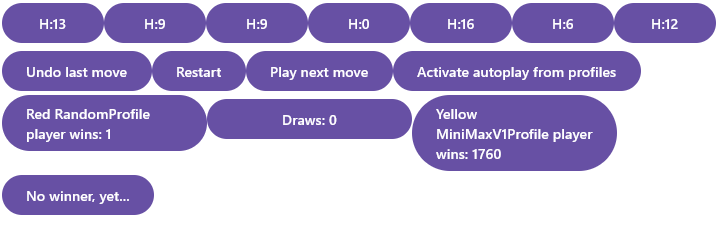

# Viikko 4

## Mitä olen tehnyt tällä viikolla?

Tällä viikolla oli vähän hitaampi viikko, koska muu elämä tuli tielle.  
Mutta sain silti minimaxin toimimaan ja huh huh kun tuntuu julmalta koneelta.  
Itse en ainakaan osannut voittaa sitä kertaakaan noin kymmenestä kerrasta kun kokeilin.

Alla muutamia otteita minimax v random/minimax peleistä:

Kuvateksti:  
Kuvassa on useampi tunti minimaxin ja randomin välillä pelejä.
Minimaxi muistaakseni on 4 syvyydellä.  
Minimax ei käytä heurestiikaa tässä kuvassa.  
  
  
  

Kuvateksti:  
Punainen pelaaja on minimax syvyydellä 1.  
Keltainen on minimax syvyydellä 5.  
Kumpikaan ei käytä heurestiikaa.  
Usempi tunti pelejä takana.  
  

Kuvateksti:  
Kuvassa muutama minuutti minimax syvyydellä 5 sekä heuristiikalla vastaan random.  

Kuvateksti:  
Minimax syvyydellä 5, heuristiikalla sekä alpha/beta -karsinnalla vastaan random.  
Kuvassa on noin viisi minuuttia pelejä.

## Miten ohjelma on edistynyt?
Minimax toimii ja maailma on mukavasti.  

## Mitä opin tällä viikolla / tänään?
Tämän hetkisen pohjalta alpha/beta -karsinta tuntuu huomattavasti nopeammalta jo viiden syvyydellä.   
Mutta jossain kohtaa on vielä mätää kun sen voitto prosentti huononeen merkittävästi randomia vastaan verrattuna ilman A/B-karsintaa.

## Mikä jäi epäselväksi tai tuottanut vaikeuksia?
Järkevät testit tämmöisellä tuottaa päänvaivaa ja nyt varmaankin tarvitsee pohtia miten heurestiikaa toteuttaa kunnolla jotta A/b-karsinta lähtee toimimaan.  

## Mitä teen seuraavaksi?
Tutkiskelen miten A/B-karsintaa oijentaa, eli pikkuisen kattelen heuristiikaa.
Sitten pitänee alkaa pohtia iteratiivista syvenemistä ja transpositiotaluja.
Miten ne sitten ikinä ilmeneekään.

Ja toteutan viikon viisi alussa myös testaus ja toteutus dokumentit.

## Ajan käyttö:

| Päivä       | aika | syy                                            |
|-------------|------|------------------------------------------------|
| 30/07       | 1h   | Pohdintaa                                      |
| 31/07       | 5h   | Oli jotain gradle säätöä kun buildi ei toiminu |
| 01/08       | 6h   | Korjailua ja dokumentointia                    |
| 02/08       | 2h   | Minimax korjailua                              |
| 03/08       | 2h   | Raportointi                                    |
| 30/07-03/08 | 16h  | This weeks total                               |
| 10/07-??/08 | 104h | Total Total                                    |
