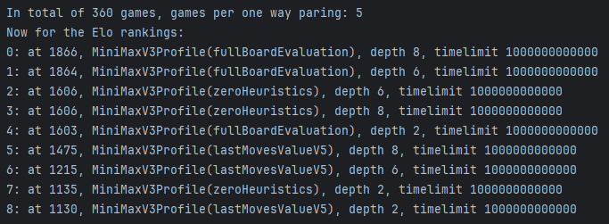
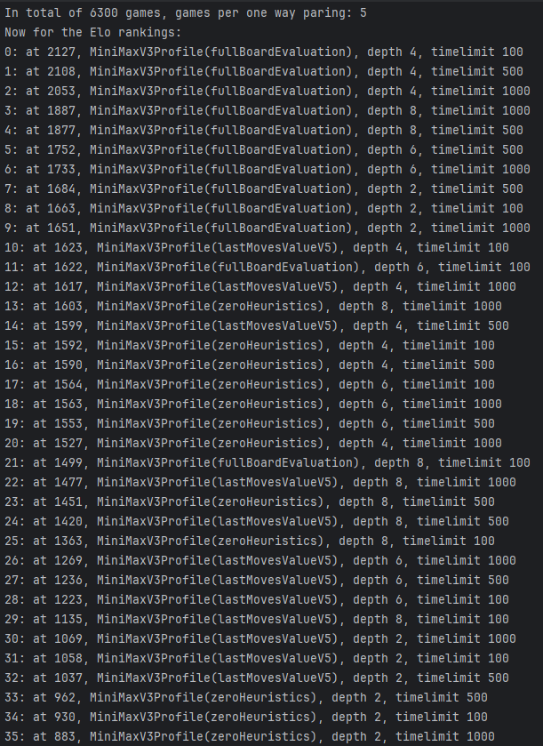

# Viikko 4

## Mitä olen tehnyt tällä viikolla?

Toteutin laudan evaluaation.

## Miten ohjelma on edistynyt?

Sain vihdoinkin ajatukseni ja itseni järjestykseen, Hannun avulla, kiitos kiitos.

## Mitä opin tällä viikolla / tänään?

"Ensin tee vaikka mikä hackätty versio.  
Sitten kun tarvitset toisen kerran tee if lause mutta mietä rakennetta.
Kolmannella kerralla generalisoi."
On vallan toimiva matra mitä pitää yrittää muistaa.

Oli myös jännä huomata miten hyvin jo tämä heurestiikka toimii.
Alla oleva kuva on pieni tournamentti ja sen tulokset:

Ja täällä vielä isompi turnaus missä oli hauska nähdä että fullboard käytännössä aina on paras (huh, vihdoin ja viimein).  

## Mikä jäi epäselväksi tai tuottanut vaikeuksia?

Ei isommin mikään, omaa perus säätöä mutta kyllä se tästä.

Tosin:  
https://connect4.gamesolver.org/?pos=44444222245355266776662611135533  
Jos tarkastelee tuota tilannetta, minun heurestiikkani sanoo että keltasella on parempi asema, vaikka kuten auto
maattisesti pelatessa näkyy, punainen voittaa aina.

Ei ehkä isoin juttu mutta jos siihen on joku simppeli ratkasu niin mietin mieluusti sen korjaamista.

## Mitä teen seuraavaksi?

Ajan turnauksen uudella ja vanhalla heurestiikalla.
Iteratiivisen syvenemisen ja liike järjestämisen.

## Ajan käyttö:

| Päivä       | aika | syy                     |
|-------------|------|-------------------------|
| 22/11       | 6h   | Laudan evaluoinnin teko |
| 23/11       | 2h   | Pientä hieno säätöä     |
| 22-23/11    | 8h   | This weeks total        |
| 27/10-22/11 | 21h  | Total Total rebooted    |
